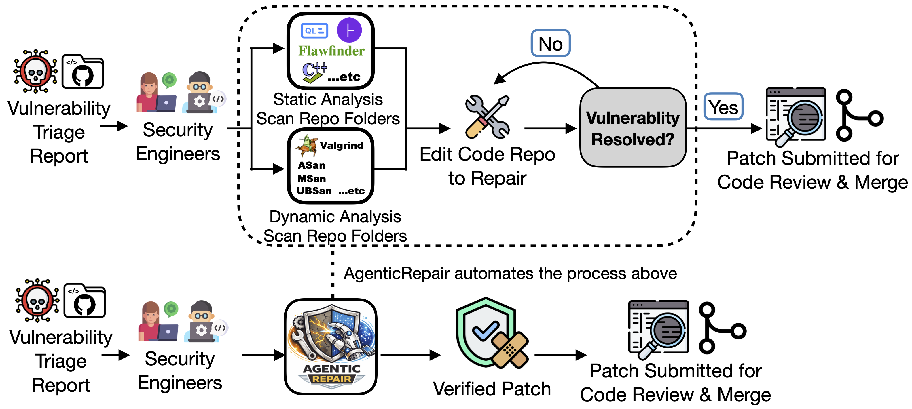
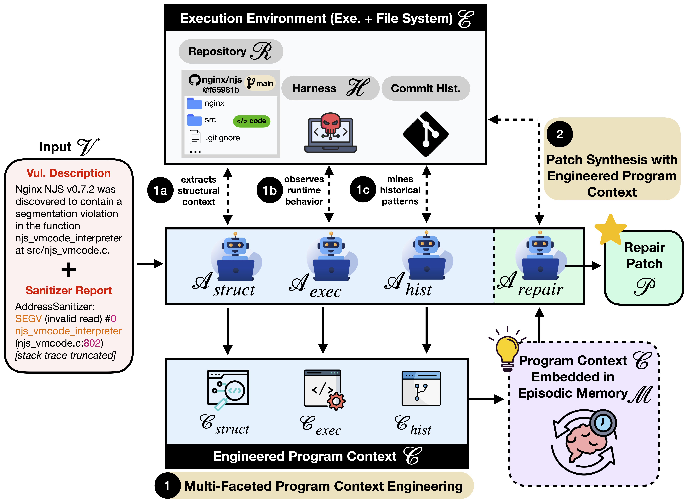

<div align="center">


# AgenticRepair

**Multi-faceted program context engineering for agentic vulnerability repair**

[](ARTIFACTS.md)
[](https://huggingface.co/datasets/SEC-bench/SEC-bench)
[](#environment-setup)
[](#environment-setup)

</div>

---

## What it does

A vulnerability report normally sends an engineer through static scans, sanitizer runs, and commit history before a patch is written. AgenticRepair runs that loop as a multi-agent pipeline and submits a verified patch.

<div align="center">
  
</div>

| Agent | What it contributes |
| --- | --- |
| Static analyzer | Structure of the vulnerable code |
| Dynamic analyzer | Runtime behavior under the sanitizer |
| History miner | Prior fixes in the repository |
| Fixer / verifier | The patch, checked against the failure |

---

## Architecture

<div align="center">
  
</div>

---

## Contents

| | |
| --- | --- |
| [Environment](#environment-setup) | Python, Docker, and the local agent library |
| [Configure](#configure-agenticrepair) | Models, dataset split, output path |
| [Run](#run-agenticrepair) | Full pipeline, or a single instance |
| [Ablations](#run-ablation-studies) | Turn individual agents off |
| [Outputs](#outputs) | Patches, trajectories, and logs |
| [Evaluate](#evaluate-results) | Score a finished run |
| [Artifacts](#experimental-artifacts) | Paper logs already in this repository |
| [Citation](#citation) | |

---

## Environment setup

| Requirement | Notes |
| --- | --- |
| OS | Linux, or Windows with WSL |
| Python | 3.10 or later |
| Docker | Running. Images `hwiwonlee/secb.eval.x86_64.*` are pulled on first use |

Images are `x86_64`. On Apple Silicon, Docker emulates them. That works, and it is slower.

### 1. Virtual environment

```bash
cd AgenticRepair
python -m venv .venv
source .venv/bin/activate
```

### 2. Install the local agent library

The pipeline depends on the `smolagents` fork in `agenticrepair/`. Do not install `smolagents` from PyPI. That package does not include these tools or the multi-agent workflow.

```bash
pip install -e "./agenticrepair[secb,docker,litellm]"
```

The `smolagent` command then resolves to this repository.

---

## Configure AgenticRepair

Edit `config_patch_agenticrepair.toml` before a run.

### Models

```toml
[model_analyzer]
type = "LiteLLMModel"
model_id = "YOUR_ANALYZER_MODEL_ID"
api_key = "YOUR_API_KEY_HERE"

[model_fixer_verifier]
type = "LiteLLMModel"
model_id = "YOUR_FIXER_VERIFIER_MODEL_ID"
api_key = "YOUR_API_KEY_HERE"
```

### Dataset

```toml
[dataset]
name = "SEC-bench/SEC-bench"
split = "cve"  # eval, cve, or oss
instance_ids = ["gpac.cve-2023-4754"]
```

`name` is the Hugging Face dataset id. Remove `instance_ids` to run the whole split.

### Output

```toml
[output]
output_dir = "/absolute/path/to/AgenticRepair/results"
```

`output_dir` must be an absolute path. Docker volume mounts reject relative paths. Each run writes a timestamped directory under that path.

---

## Run AgenticRepair

```bash
source .venv/bin/activate
./run_patch_agenticrepair.sh
```

That script is `smolagent secb-run --config config_patch_agenticrepair.toml`.

| Goal | Command |
| --- | --- |
| Two workers | `smolagent secb-run --config config_patch_agenticrepair.toml --num-workers 2` |
| One instance | `smolagent secb-run --config config_patch_agenticrepair.toml --instance-id gpac.cve-2023-4754` |

---

## Run ablation studies

Ablations use the same config file. Set an analyzer to `false` to drop that source of context, then run `./run_patch_agenticrepair.sh` again.

| Ablation | Static | Dynamic | History | Prompt |
| --- | --- | --- | --- | --- |
| Full AgenticRepair | `true` | `true` | `true` | default |
| No static analysis | `false` | `true` | `true` | default |
| No dynamic analysis | `true` | `false` | `true` | default |
| No history mining | `true` | `true` | `false` | default |
| Single-agent scaffold | `false` | `false` | `false` | `patch_single_agent_scaffold_ablation.j2` |

```toml
[analyzer_enabled]
enable_static_analyzer = true
enable_dynamic_analyzer = true
enable_history_miner = true
```

For the single-agent scaffold, also set:

```toml
[prompt_templates]
fixer_verifier = "patch_single_agent_scaffold_ablation.j2"
```

That template is `agenticrepair/src/smolagents/prompts/patch_single_agent_scaffold_ablation.j2`.

The single-agent baseline in the paper uses a different file, `config_patch.toml`, with `[scaffold] type = "single"`.

---

## Outputs

A new run still writes a timestamped directory under `output_dir`. The released runs in this repository are named directly, for example `results/agenticrepair-gpt-5.2`. Each of those directories contains:

| Path | Contents |
| --- | --- |
| `<instance>/git_patch.diff` | Patch the agent produced |
| `<instance>/artifacts/` | Per-agent trajectories and `summary.json` |
| `output.jsonl` | One row per instance, as the run wrote it |
| `<instance>/error.txt` | Present when that instance failed |

See [ARTIFACTS.md](ARTIFACTS.md) for the file layout of the released runs.

---

## Evaluate results

`eval_and_view_patch.sh` scores a finished run and prints the table. Point it at the run directory:

```bash
python -m secb.evaluator.eval_instances \
    --input-dir ./results/agenticrepair-gpt-5.2 \
    --type patch \
    --split eval \
    --agent smolagent \
    --mode all \
    --output-dir ./output/eval/patch
```

Use the split you ran: `eval`, `cve`, or `oss`. Then:

```bash
python -m secb.evaluator.view_patch_results \
    --agent smolagent \
    --input-dir ./output/eval/patch
```

`--mode` accepts `strict` (exit code 0 only), `medium` (exit code must match the dataset), `generous` (any non-timeout exit without sanitizer errors), or `all`.

---

## Experimental artifacts

Logs and trajectories from the paper are already in this repository.

| Tree | What is in it |
| --- | --- |
| [`results/`](results) | Per-instance trajectories, patches, and scored reports |
| [`reports/`](reports) | The same run-level reports, under the same directory names |

[ARTIFACTS.md](ARTIFACTS.md) maps each directory to a configuration and records how many instances it resolved.

---

## Customization

`config_patch_agenticrepair.toml` controls models, tools, which analyzers run, the dataset split, the output directory, and runtime limits.

Prompt templates live in `agenticrepair/src/smolagents/prompts/`.

---

## Citation

```bibtex
Under Review
```
